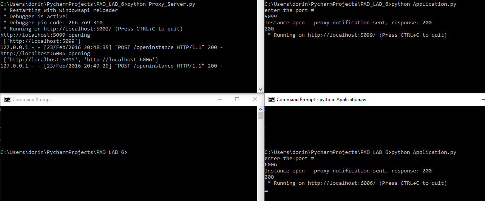

# LAB #6

## Objectives:
- Implement a reverse proxy and acheive access transparency
- Replicate a data warehouse
- Build a RESTful interface on a **cassandra** database which will store information about employees (id, name, surname , age)
- Improve the performance of the proxy by using **Redis** for caching

### The solution:

### Instruments:
- Python programming language (v. 2.7), PyCharm IDE
- Flask, Flask-Restful
- Redis, redis python modules
- Apache Cassandra 3.1, cassandra python modules.

For the reverse proxy i used an **Flask** extension for building REST APIs called **Flask-Restful**.
It works in the following way: the proxy server by default will have the port 5002 open and will listen for incoming connections. For connecting other applications it is required to access host-address:port/openinstance. If the connection will be successful the applications will be added to a list.
Clients wouldn't know the address of the applications added in that list and they will be able to use their services only by accessing the proxy server.
The address host-address:port/employees/<int:id> will be used by clients.

Proxy-server is using a very simple round-robin task scheduling.

Screenshot:

